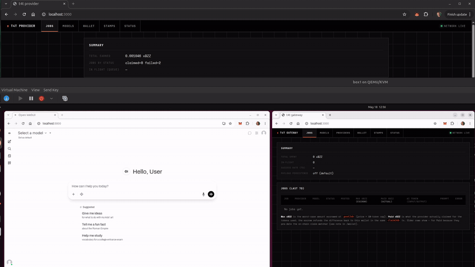

# Token4Token (T4T)

Decentralized AI inference marketplace on Gnosis Chain + Ethereum Swarm.



Clients pay providers in **xBZZ** to run inference on locally-hosted Ollama models. Requests and responses are stored on Swarm, addressed by hash. Job coordination happens via Swarm PSS. Payment, escrow, registry, and slashing are enforced by Solidity contracts on Gnosis Chain.

ENS: `t4t.eth`. Full protocol: [`docs/spec.md`](docs/spec.md).

## Repository layout

```
t4t/
├── contracts/           # Foundry: ProviderRegistry, JobEscrow
│   ├── src/
│   ├── test/
│   └── script/Deploy.s.sol
├── container/           # TS: one image, two modes
│   ├── src/
│   │   ├── lib/         # envelope, swarm, chain, ollama, crypto, config
│   │   ├── modes/gateway/
│   │   └── modes/provider/
│   ├── test/
│   └── Dockerfile
├── docs/
│   ├── spec.md
│   ├── architecture.md
│   ├── getting-started-gateway.md
│   └── getting-started-provider.md
├── website/             # t4t.eth landing page + live model directory
├── docker-compose.provider-example.yml   # provider + ollama (+ optional bee)
├── docker-compose.gateway-example.yml    # gateway + open-webui (+ optional bee)
└── Makefile
```

## Quick start

Prereqs: Foundry, Node ≥ 20, Docker (optional), a Bee node, an Ollama node, and a Gnosis Chain RPC.

```bash
make install            # forge install + npm install
make test               # forge test + vitest (hermetic)
make build              # forge build + tsc
make docker             # build container image
```

### Fork tests

Run the contract suite end-to-end against a Gnosis Chain fork and the real
xBZZ ERC-20 — mirrors SwarmChat's fork-test pattern:

```bash
FORK_GNOSIS_RPC_URL=https://rpc.gnosischain.com make test-contracts-fork
```

Wallets are seeded via `vm.deal`; no whale impersonation needed. Excluded
from `make test` so the default loop stays hermetic.

### Local end-to-end (M1)

1. Run Anvil forked from Gnosis: `make anvil`
2. Deploy contracts: `make deploy-local` (writes addresses to console)
3. Copy the relevant example (`docker-compose.provider-example.yml` or `docker-compose.gateway-example.yml`) → `docker-compose.yml`. Defaults work against the live Gnosis-mainnet deployment; the admin UI handles wallet onboarding on first boot.
4. `docker compose up bee ollama`
5. Pull a model: `docker exec -it $(docker compose ps -q ollama) ollama pull llama3:8b`
6. `docker compose up t4t-provider t4t-gateway`
7. Point any OpenAI-compatible app at `http://localhost:8080/v1`

See [docs/getting-started-gateway.md](docs/getting-started-gateway.md) and [docs/getting-started-provider.md](docs/getting-started-provider.md) for details.

## Status

Scaffold for M1 ("Loop closed"). Cipher is currently a passthrough — see `container/src/lib/crypto.ts`. ECIES wire-up and event-indexed claimJob resolution land before M2. Roadmap in [`docs/spec.md` §12](docs/spec.md).

Inspired by [SwarmChat](https://github.com/ffaerber/SwarmChat) — same envelope discipline, same Gnosis + Swarm substrate.
