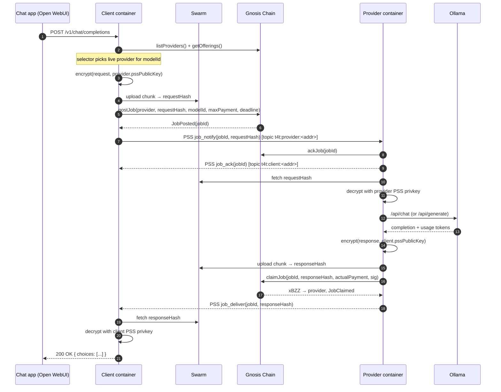

# Job Flow — Client ↔ Provider

How a single inference request travels from an OpenAI-compatible chat app to a
provider's Ollama and back. The protocol contract is in [`spec.md`](spec.md) §3
and §5; this doc shows the same flow grounded in the actual container code, so
you can follow a request through the source.

Three channels carry traffic, each with a strict role:

| Channel | Carries | Trust model |
|---|---|---|
| **Gnosis Chain** (RPC) | Money, identity, deadlines, slashing | Source of truth for payment |
| **Swarm** (chunks) | Encrypted request and response payloads | Content-addressed; integrity by hash |
| **Swarm PSS** (pubsub) | `jobId` notifications, ACKs, delivery pings | Best-effort coordination only |

**Invariant:** if PSS drops every message, the on-chain deadlines + slashing
still settle the job. PSS is convenience, not safety.

---

## Happy path

---

## Step-by-step (with code pointers)

### 1. App → Client: OpenAI request comes in
The chat app POSTs to `http://<client>:8080/v1/chat/completions`. The client
container runs an Express shim that mimics the OpenAI HTTP surface.

→ [container/src/modes/client/server.ts](container/src/modes/client/server.ts)

### 2. Client: pick a provider
The selector reads the on-chain registry (`listProviders`) and filters by:
- `active && isLive` (heartbeat within `HEARTBEAT_TTL = 600s`)
- offers requested `modelId`
- `pricePerKToken * maxTokens ≤ user budget`
- best `maxLatencySeconds` SLA wins ties

→ [container/src/modes/client/selector.ts](container/src/modes/client/selector.ts) · uses
[container/src/lib/chain.ts](container/src/lib/chain.ts)

### 3. Client: encrypt + upload request
Request JSON (full OpenAI body) is encrypted with ECIES against the provider's
`pssPublicKey` (from the registry), uploaded as a single Swarm chunk under the
client's postage batch. Result: a `requestHash`.

→ [container/src/lib/crypto.ts](container/src/lib/crypto.ts) ·
[container/src/lib/swarm.ts](container/src/lib/swarm.ts)

### 4. Client: `postJob` on-chain
Calls `JobEscrow.postJob(provider, requestHash, modelId, maxPayment, deliveryDeadline)`.
This transfers `maxPayment` xBZZ into escrow. The contract returns a `jobId`
(also surfaced as the `JobPosted` event) and reverts if the provider's open-job
concurrency would exceed its stake (oversubscription protection).

→ [contracts/src/JobEscrow.sol#postJob](contracts/src/JobEscrow.sol) ·
[container/src/modes/client/index.ts](container/src/modes/client/index.ts)

### 5. Client → Provider: PSS `job_notify`
Sends an envelope (canonical JSON + EIP-191 sig) on topic
`t4t:provider:<provider-address>`. Body: `{ jobId, requestHash, modelId, maxPayment, deliveryDeadline }`.

→ [container/src/lib/envelope.ts](container/src/lib/envelope.ts) ·
[spec.md §5](docs/spec.md)

### 6. Provider: ACK on-chain + over PSS
`listener.ts` subscribes to the provider's PSS topic. Each incoming envelope is
verified (signature, freshness, nonce), then handed to a worker. The worker
calls `JobEscrow.ackJob(jobId)` on-chain (so the client can't `cancelJob` on
"no ack") and replies with a PSS `job_ack` envelope on the **client's** topic
`t4t:client:<client-address>`.

→ [container/src/modes/provider/listener.ts](container/src/modes/provider/listener.ts) ·
[container/src/modes/provider/worker.ts](container/src/modes/provider/worker.ts)

### 7. Provider: fetch + decrypt + infer
Worker fetches `requestHash` from Swarm, decrypts with the provider's PSS
private key (separate from the wallet key — see commit `98974a1`), then proxies
the decoded body to local Ollama.

→ [container/src/modes/provider/worker.ts](container/src/modes/provider/worker.ts) ·
[container/src/lib/ollama.ts](container/src/lib/ollama.ts)

### 8. Provider: encrypt + upload response
The Ollama response (including `usage.completion_tokens`, which feeds
`actualPayment`) is encrypted to the client's `pssPublicKey` and uploaded as a
Swarm chunk. Result: `responseHash`.

### 9. Provider: `claimJob` on-chain
`JobEscrow.claimJob(jobId, responseHash, actualPayment, clientSig)` — settles
the escrow. `actualPayment` must be ≤ `maxPayment`; remainder refunds to the
client. The optional `clientSig` (EIP-191 over the response receipt) shortcuts
finalization; absent it, time-based finalization still works.

→ [contracts/src/JobEscrow.sol#claimJob](contracts/src/JobEscrow.sol)

### 10. Provider → Client: PSS `job_deliver`
Envelope on `t4t:client:<client-address>` with `{ jobId, responseHash }`. The
client can also pick this up by watching `JobClaimed` events on-chain — PSS
just gets it there faster.

### 11. Client: fetch + decrypt + return
Client fetches `responseHash`, decrypts with its PSS private key, returns the
plain OpenAI completion to the chat app.

---

## Failure paths

| Trigger | Who calls what | On-chain effect |
|---|---|---|
| Provider never ACKs within `ACK_WINDOW = 30s` | Client → `JobEscrow.cancelJob(jobId)` | Slash = `min(stake, max(2·maxPayment, MIN_SLASH))`. 1.5× `maxPayment` refunds to client as apology; remainder → Treasury. Escrowed payment fully refunded. |
| Provider ACKs but never delivers by `deliveryDeadline` | Client → `JobEscrow.timeoutJob(jobId)` | Slash = `min(stake, max(3·maxPayment, MIN_SLASH))`. Same split. Payment refunded. |
| Client offline at delivery | Provider can still `claimJob` solo; client picks up `responseHash` from the `JobClaimed` event next time it polls | No slash. |
| Provider's heartbeat goes stale (`HEARTBEAT_TTL` exceeded) | Client selector silently skips them. Existing jobs settle normally. | No slash from staleness alone — only from missed deadlines. |
| PSS message lost or corrupted | Both sides poll their own chain events as a backstop. Deadlines still tick. | Eventual settlement via deadline + slash, never deadlock. |

Constants live in [contracts/src/JobEscrow.sol](contracts/src/JobEscrow.sol)
and [contracts/src/ProviderRegistry.sol](contracts/src/ProviderRegistry.sol).
At 16-decimal xBZZ: `MIN_STAKE = 100 BZZ`, `MIN_SLASH = 1 BZZ`, `ACK_WINDOW = 30s`,
`HEARTBEAT_TTL = 600s`, `UNBONDING_PERIOD = 2 days`.

---

## Identity model

Each container holds **two** keys, intentionally separated:

- **Wallet key** — Gnosis EOA. Signs `postJob` / `ackJob` / `claimJob` /
  `register` / `heartbeat` transactions. Holds xBZZ stake and balance.
- **PSS key** — secp256k1 keypair used only for envelope signing and ECIES
  payload encryption. Public key is registered on-chain alongside the provider
  (`pssPublicKey` field) so clients can encrypt to it.

Splitting them means the wallet key can stay cold(er) while the always-online
container holds a key that, if compromised, leaks only payload encryption — not
funds.

→ [container/src/lib/config.ts](container/src/lib/config.ts) (loads both keys)

---

## Where to start reading the code

- **Run a request through the system** — start at
  [container/src/modes/client/server.ts](container/src/modes/client/server.ts),
  follow into [container/src/modes/client/index.ts](container/src/modes/client/index.ts),
  hop to [container/src/modes/provider/listener.ts](container/src/modes/provider/listener.ts).
- **Understand a failure** — read [contracts/src/JobEscrow.sol](contracts/src/JobEscrow.sol)
  end-to-end; it's <250 lines and is the actual settlement.
- **Add a new envelope type** — extend the union in
  [container/src/lib/envelope.ts](container/src/lib/envelope.ts) and add handlers
  on both sides.
